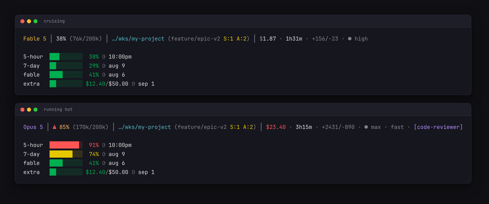

# Claude Epic Status Line

A feature-rich status line for [Claude Code](https://code.claude.com) that displays model info, context usage, git status, rate limits, session cost, and more — all with color-coded segments.

## What it looks like



## Features

| Segment | Description |
|---------|-------------|
| **Model** | Short model name (e.g., `Opus 4.6` instead of `Claude Opus 4.6`) |
| **Context** | Usage percentage + token counts (e.g., `12% (42k/200k)`) with color coding |
| **Auto-compact warning** | Blinking `⚠` when context usage >= 80% |
| **Directory** | Truncated to last 2 path components |
| **Git branch** | Branch name with detailed status: staged (`S:2`), unstaged (`U:1`), untracked (`A:3`) |
| **Git ahead/behind** | `⇡2⇣1` arrows showing commits ahead/behind upstream |
| **Worktree** | `⎇wt` indicator when running inside a git worktree |
| **Session cost** | `$X.XX` when cost data is available |
| **Session duration** | `⏱ 5m`, `⏱ 1h30m`, etc. |
| **Effort level** | `● high`, `◑ medium`, `◔ low` |
| **Rate limits** | Visual `●○` progress bars for 5-hour, 7-day, and extra usage with reset times |

### Color coding

All percentage-based segments use consistent color thresholds:

- **Green** — below 50%
- **Orange** — 50-69%
- **Yellow** — 70-89%
- **Red** — 90%+

## Requirements

- `jq` — JSON parsing
- `curl` — fetching rate limit data from the Anthropic API
- `git` — branch and worktree detection

## Installation

### Quick install

```bash
git clone https://github.com/dsebastien/claude-epic-status-line.git
cd claude-epic-status-line
bash install.sh
```

### Manual install

1. Copy `statusline.sh` to `~/.claude/statusline-command.sh`
2. Add this to your `~/.claude/settings.json`:

```json
{
  "statusLine": {
    "type": "command",
    "command": "bash /home/YOUR_USER/.claude/statusline-command.sh"
  }
}
```

3. Restart Claude Code.

## Uninstall

```bash
bash uninstall.sh
```

Or manually remove the `statusLine` key from `~/.claude/settings.json` and delete `~/.claude/statusline-command.sh`.

## How it works

The script receives JSON from Claude Code via stdin with session data (model, context window usage, cwd, session start time, cost, etc.). It parses everything in a single `jq` call for performance, then assembles the status line segments.

Rate limits are fetched from the Anthropic API using your OAuth token (resolved from `CLAUDE_CODE_OAUTH_TOKEN`, `~/.claude/.credentials.json`, `secret-tool` on Linux, or macOS Keychain). Results are cached for 60 seconds in `/tmp/claude/statusline-usage-cache.json`.

## Platform support

Works on Linux and macOS. Date formatting and credential resolution adapt automatically to the platform.

## Support

If you find this useful, consider [buying me a coffee](https://www.buymeacoffee.com/dsebastien).

Check out my other projects at [dsebastien.net](https://dsebastien.net).

## Credits

Inspired by [kamranahmedse/claude-statusline](https://github.com/kamranahmedse/claude-statusline).

## License

MIT
